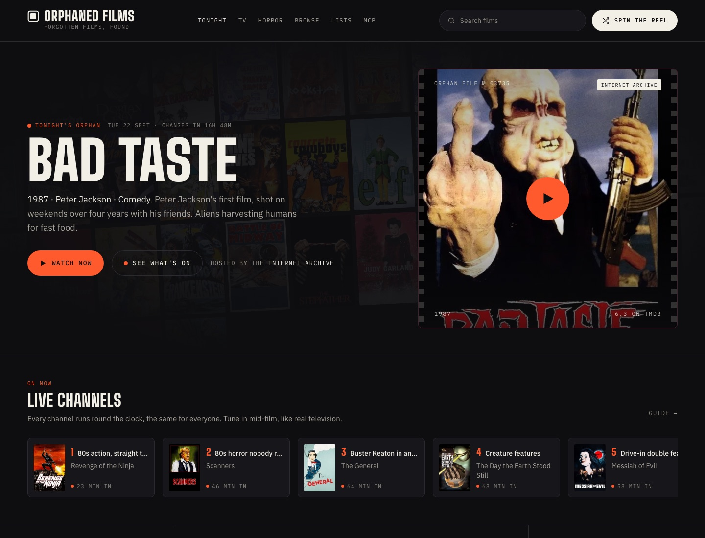
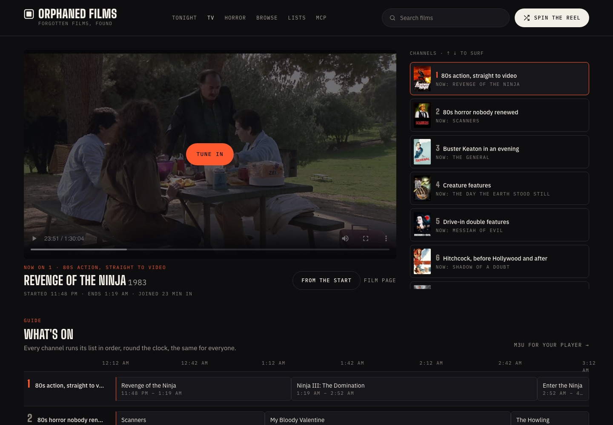
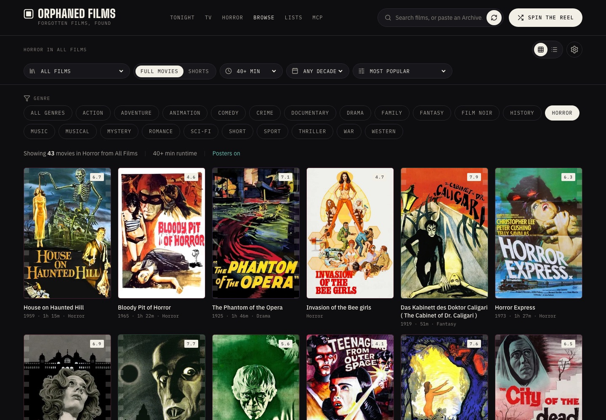
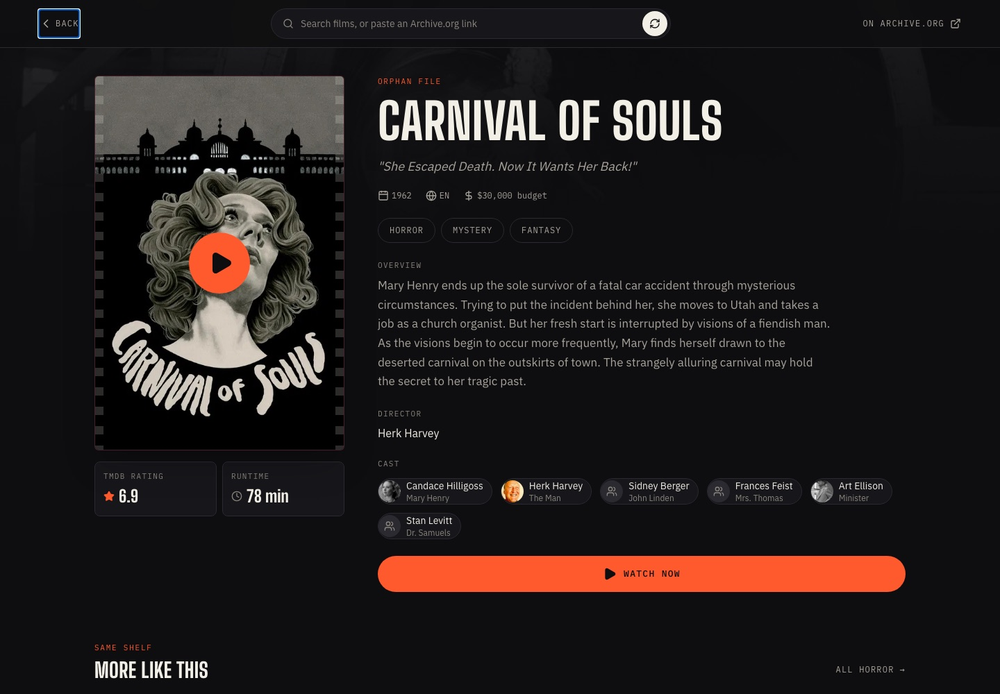

# Orphaned Films

**Forgotten films, found.** A viewer for the films nobody claimed, hosted by the [Internet Archive](https://archive.org): real posters for thousands of them, live television channels that run round the clock, curated lists, a player that remembers where you were, and an MCP server so an assistant can find you something to watch.

Live at **[orphanedfilms.com](https://www.orphanedfilms.com)**. The films are streamed by the Internet Archive; this site indexes, plays and arranges them. Nothing here is ours.

| Tonight | Television |
|---|---|
| [](https://www.orphanedfilms.com) | [](https://www.orphanedfilms.com/tv) |
| One hand-picked cult film a day, what is on the channels, and rows with a reason. | Nine channels playing their lineups in order from a fixed moment, so the same film is on for everyone. Tune in mid-film. |

| Browse | A film |
|---|---|
| [](https://www.orphanedfilms.com/browse?genre=Horror) | [](https://www.orphanedfilms.com/browse#CarnivalOfSouls1962) |
| Collection, genre, decade, length and sort, in the URL so any view is a link. | The film the upload really is, with poster, cast, director, and a shelf of films like it. |

## What it does

- **Tonight's film.** One cult film a day from a hand-picked list (`src/programme/featured.json`), with a line on why. Rotates in order, never runs dry.
- **Television.** Every curated list is a channel. Each plays its films in order from a fixed moment, so what is on is the same for everyone, and you join mid-film like real TV. The set moves to the next film on its own. ↑ ↓ change channel. "From the start" restarts the film. The same schedule is published as an **M3U playlist** and an **XMLTV guide** for other players (see [Feeds](#feeds)).
- **Posters that are right.** A [poster index](#poster-index) decides offline which TMDB film each Archive.org upload is, or that it is none. Indexed films show their real poster with no TMDB key and no requests. The rest get a generated cover.
- **Browse** with every filter: collection, genre pills, decade, runtime, sort, grid or list. Two uploads of the same film collapse to the better copy. Old `/?genre=` and `/#film` links still work.
- **A film page** that says what the upload really is ("Uploaded as Zombi Holocaust 1980. Identified by the poster index"), with tagline, cast you can click to search, director, and "More like this".
- **Our own player.** Arrow keys skip, Space pauses, F is full screen, Esc closes, and it resumes where you left off. "Continue watching" on the front page comes from that, kept in your browser, sent nowhere.
- **Lists.** Hand-picked films with a note on each, as pages. One JSON file each, anyone can add one, and every list is also a channel.
- **Search** with type-ahead over titles, genres, collections and the tags uploaders use, plus paste-an-Archive-link.
- **MCP server.** Search and browse the films from Claude, Cursor or any MCP client. Hosted at `/api/mcp` and runnable locally from `mcp/`.

## Feeds

The television schedule is public, in three shapes, all computed from the same clock:

| URL | What it is |
|---|---|
| `/api/tv` | JSON: every channel, its lineup, what is on now (with the offset in seconds), and the next six hours |
| `/api/tv/playlist.m3u` | Extended M3U: each channel's lineup in order, with lengths, `tvg-id`, `tvg-chno`, `group-title`, posters as logos, and direct Archive.org streams |
| `/api/tv/guide.xml` | XMLTV for the next 24 hours |

Point VLC, Kodi, TiviMate or [StreamVault](https://github.com/amponce/streamvault) at the M3U and the guide. A player that reads `now.offset` from the JSON and seeks to it is tuning into a live channel that exists nowhere else.

The channels are not live streams. They are files on the Internet Archive played in an order from a fixed moment; the arithmetic is in `src/services/schedule.js`, and it is the same on the site and in the feeds.

## Getting started

```bash
git clone https://github.com/amponce/archive-movie-browser.git
cd archive-movie-browser
npm install
npm run dev        # http://localhost:3000, with the api/ functions served locally
npm test
npm run build
```

Optional keys go in `.env.local` (see `.env.example`). Without any key the site works: indexed films have posters, television runs, search and browse work. A TMDB key adds live poster matching for films outside the index and cast, director and ratings on the film page.

| Variable | For | Required |
|---|---|---|
| `VITE_TMDB_API_KEY` | Live poster matching and film details in the browser | No |
| `TMDB_API_KEY`, `OPEN_ROUTER_API_KEY` | Building the poster index (`npm run index`) | Only to build the index |
| `OMDB_API_KEY` | A second candidate source when the index gives up (`--retry-none`) | No |
| `KV_REST_API_*`, `STATS_TOKEN` | Own usage counts and the private `/stats` page | No |

## Add a list, get a channel

A list is one JSON file in `src/lists/`: a slug, a title, a blurb, your handle, and Archive.org identifiers in the order you want them shown, each with an optional one-line note. [`src/lists/README.md`](src/lists/README.md) has the format.

Every list is also a channel. After adding or editing one, run `npm run tv` to fetch each film's playable stream and length into `public/tv-lineups.json`, and commit both. Pick uploads the poster index knows (search the site and look at the film's link), so the list and the channel have covers. Ten to fifteen films is a good channel. Repeats are how television works.

## How it is built

React 19, Vite, Tailwind. No router, no state library, no UI kit. Vercel serves the site and the functions in `api/`.

```
tailwind.config.js        tokens: ink, bone, signal, line; Big Shoulders Display, IBM Plex
src/index.css             shapes: .btn-*, .pill, .control, .field, .film-frame, .display, .eyebrow, .label
src/ui/                   primitives: Button, Section, FilmCard, SearchField
src/layout/               SiteHeader, SiteFooter, on every page
src/pages/                Home, Tv, Lists, Mcp, Stats; the film browser is src/components
src/components/home/      one file per front-page section
src/services/             pure logic, tested: archive (queries), posterIndex, programme, rows,
                          schedule, playback, urlFilters, suggest, lists, coverDesign
src/hooks/                useFilms, useRelated, usePosterIndex, useRow
src/programme/            featured.json, the hand-picked films of the day
src/lists/                the lists, one JSON each
public/poster-index.json  the index: upload -> film, poster, year, rating, confidence
public/tv-lineups.json    upload -> playable stream and length, for the channels
api/                      event (usage counts), stats, mcp, tv
mcp/                      the MCP server, stdio and hosted
scripts/                  build-poster-index, build-tv-lineups
```

Three rules keep it that way. Tokens define, shapes and primitives style, pages compose: a visual change is a one-file change, and a long `className` in a page belongs in a primitive. Logic lives in `src/services` with no React and no DOM, so it is tested with `node --test` and reused by the MCP server and the functions. A deliberate shortcut carries a `ponytail:` comment naming its ceiling and what replaces it.

## Poster Index

Archive.org titles are messy (`H 2 House On Haunted Hill ( 1959) Classic Vincent Price Horror Full Movie`), so matching them to TMDB in the browser misses a lot. `public/poster-index.json` holds decisions made offline instead: for the most-downloaded uploads in each film collection, which TMDB film it is, or that it is none. The app checks the index first, so indexed films get real posters **with no TMDB key and no TMDB requests**, and anything not indexed falls back to live matching.

- Build or extend it with `npm run index` (options are in the header of `scripts/build-poster-index.mjs`; `--views` follows the genre pills and decades, `--cross Horror` walks a genre in every decade, `--retry-none` gives the films it gave up on a second look with OMDb candidates). It needs a TMDB key and an OpenRouter key in `.env.local`; see `.env.example`. A decision is permanent per Archive.org identifier, so reruns only pay for new uploads. 750 uploads cost about 3 cents.
- The decisions come from a small decision model (`typesafe/jev-1.13`), which picks among the TMDB candidates we fetch and reports a confidence. Below 0.7 the app shows the generated cover instead: a wrong poster is worse than none. On a hand-labelled set of 80 hard search results this got 67 right with 0 wrong posters, against 43 right and 5 wrong for the in-browser heuristics.
- A scheduled workflow refreshes it weekly and pushes the result to a branch for review.
- **Found a wrong poster?** Edit that identifier's entry in `public/poster-index.json` and open a PR. Setting it to `{ "n": 1, "c": 1, "m": 1 }` means "show the generated cover"; `"m": 1` marks an entry as corrected by hand, and the build script never overwrites those.

## MCP server

`mcp/` is a [Model Context Protocol](https://modelcontextprotocol.io) server built on the same Archive.org code as the site, so an AI assistant can search the films, browse collections and hand back links that play. Four tools, no API keys. Hosted at `https://www.orphanedfilms.com/api/mcp`; setup for Claude Code, Claude Desktop and Cursor is in [mcp/README.md](mcp/README.md).

## What is next

In the order we mean to do them. Open an issue if you want one.

1. **Index the whole catalogue**, about 39,000 real films, so no view ever depends on a live poster match. With genres and runtimes in the index, the newest row, "More like this" and generated channels all become file reads.
2. **25 channels.** Ten curated with a voice, fifteen generated by rule from the index (a genre, a span of decades, a rating floor). A "make us a channel" issue for anyone who wants one.
3. **Search the corrected titles**, so typing "Zombie Holocaust" finds the upload named "Zombi Holocaust 1980".
4. **Split the browser and the film page** into parts the size of the front page's. No visual change.
5. ESLint in CI.

## Privacy

The live site counts usage with its own small endpoint (`api/event.js`): no cookies, no third party, no visitor identifiers, nothing sold or shared. It stores **counts only** in a Redis database: events per day, and monthly leaderboards of films opened and played, searches, filters and referring sites. IP addresses are never stored; distinct visitors are estimated with a HyperLogLog fed by a hash that changes every day, so days cannot be linked. Search text is lowercased, cut to 60 characters, and anything shaped like an email address is removed before it leaves the browser. Bots are not counted, and everything expires after 400 days. The rulebook is `api/_stats.js` and it is tested.

A fork collects nothing unless its owner connects an Upstash Redis database (`vercel integration add upstash/upstash-kv`) and sets a `STATS_TOKEN` for the private `/stats` page.

## API Credits

- **Internet Archive** - [archive.org](https://archive.org) - Public domain movie collection and streaming
- **TMDB** - [themoviedb.org](https://www.themoviedb.org) - Movie database API for posters and metadata

> This product uses the TMDB API but is not endorsed or certified by TMDB.

## License

[MIT](LICENSE) - feel free to use this project for personal or commercial purposes.

## Contributing

Contributions are welcome, from first-time contributors and from people who just love old films. Read [CONTRIBUTING.md](CONTRIBUTING.md) for setup, what to work on, and what review looks like. See the [CHANGELOG](CHANGELOG.md) for release history. Run `npm test` and `npm run build` before opening a pull request.

1. Fork the repository
2. Create your feature branch (`git checkout -b feature/AmazingFeature`)
3. Commit your changes (`git commit -m 'Add some AmazingFeature'`)
4. Push to the branch (`git push origin feature/AmazingFeature`)
5. Open a Pull Request

## Contributors

Thanks to everyone who has had a pull request merged:

- [@dyk1454683243-sudo](https://github.com/dyk1454683243-sudo) - first outside contributor: the Shorts mode runtime control ([#21](https://github.com/amponce/archive-movie-browser/pull/21))
- [@ruthikx](https://github.com/ruthikx) - Escape, Back button and scroll lock for the detail page, plus shareable `#identifier` links to any film ([#20](https://github.com/amponce/archive-movie-browser/pull/20))
- [@mehul-vi](https://github.com/mehul-vi) - removed 174 lines of dead code ([#18](https://github.com/amponce/archive-movie-browser/pull/18))
- [@fatihcvs](https://github.com/fatihcvs) - a long run of fixes across matching, accessibility and performance, including shared film links ([#48](https://github.com/amponce/archive-movie-browser/pull/48)), keyboard access to films ([#52](https://github.com/amponce/archive-movie-browser/pull/52)), screen-reader labels for the filters ([#53](https://github.com/amponce/archive-movie-browser/pull/53)), one TMDB service with a lean cache ([#51](https://github.com/amponce/archive-movie-browser/pull/51)), accurate poster matching ([#57](https://github.com/amponce/archive-movie-browser/pull/57)), evenly spaced TMDB requests ([#56](https://github.com/amponce/archive-movie-browser/pull/56)), a precise content blocklist ([#50](https://github.com/amponce/archive-movie-browser/pull/50)), a header and footer that follow what you're browsing ([#91](https://github.com/amponce/archive-movie-browser/pull/91)), a proper modal dialog for the detail page ([#94](https://github.com/amponce/archive-movie-browser/pull/94)), and [more](https://github.com/amponce/archive-movie-browser/pulls?q=is%3Apr+is%3Amerged+author%3Afatihcvs)
- [@dw-dash-codes](https://github.com/dw-dash-codes) - the `TitleCover` component, so no view shows a raw Archive.org frame grab ([#54](https://github.com/amponce/archive-movie-browser/pull/54)); it is still the cover for every film without a poster in v2
- [@nightcityblade](https://github.com/nightcityblade) - detail page posters stay at full brightness with a labelled, focusable play button ([#71](https://github.com/amponce/archive-movie-browser/pull/71)); related-film cards work from the keyboard and read properly to screen readers ([#172](https://github.com/amponce/archive-movie-browser/pull/172), [#173](https://github.com/amponce/archive-movie-browser/pull/173)); focus stays on Load more, runtime links snap to a real option, no stray separator on cards ([#174](https://github.com/amponce/archive-movie-browser/pull/174), [#176](https://github.com/amponce/archive-movie-browser/pull/176), [#177](https://github.com/amponce/archive-movie-browser/pull/177))
- [@karthikyannabthina](https://github.com/karthikyannabthina) - filters live in the URL, so any view can be shared and the Back button works ([#100](https://github.com/amponce/archive-movie-browser/pull/100))
- [@Rokesh2008](https://github.com/Rokesh2008) - grid or list view is remembered between visits ([#110](https://github.com/amponce/archive-movie-browser/pull/110))
- [@kante-Ramanaidu](https://github.com/kante-Ramanaidu) - on phones, the selected genre scrolls into view, so shared genre links look right ([#125](https://github.com/amponce/archive-movie-browser/pull/125))
- [@MehulNegi](https://github.com/MehulNegi) - the project's changelog, from the first release on ([#141](https://github.com/amponce/archive-movie-browser/pull/141))

Want to be next? Issues labelled [good first issue](https://github.com/amponce/archive-movie-browser/issues?q=is%3Aissue+is%3Aopen+label%3A%22good+first+issue%22) are scoped, with file and line references.

## Acknowledgments

- Internet Archive for making public domain films accessible
- TMDB for their comprehensive movie database API
- The React and Vite communities
